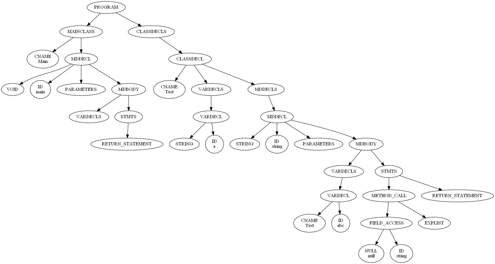

Name: Ang Wei Heng Kendrick

Matriculation Number: A0136186B

> NOTE: `./gen.py` <filename> isn't supported since I use Windows and can't use shebangs. Please use `python3 <filename>` instead!**

---

# Programming Assignment 2

# Usage
`python3 gen.py <path-to-file>`
- prints errors returned by the static checking, if they exist
- pretty-prints the IR3 for the given program otherwise

# Type Checking

The code for type checking consists of three main parts:
1. The classes for the type checking, `TypeEnvironment`, `ClassDescriptor` and `Environment`.
2. The code for initializing the type environment, `TypeEnvironment.initialize(...)`.
3. The code that traverses the AST and type-checks the tree in a bottom-up manner, `AstNode.static_check(...)`.

## `TypeEnvironment`, `ClassDescriptor` and `Environment`.
- These classes are found in `ast.py`, near the end of the file (~line 2433)
- They attempt to following the description of the Class Descriptor, Type Environment and Local Environment respectively
  (as the Appendix A mentions)
- A `TypeEnvironment` consists of a `ClassDescriptor`, containing information about a class, such as its name, field declarations
with their types, and method signatures with their types. It also has a local environment `Environment`, which maps variables
declared locally to their types.

### Details
- Of note is `TypeEnvironment.child_env()`, which creates another instance of `TypeEnvironment` with a new `Environment`
pointing to the parent `Environment`, but using the same `ClassDescriptor`. This is to simulate static block scoping.
  - ```Python3
    def child_env(self) -> 'TypeEnvironment':
        return TypeEnvironment(self.cd, self.env.child_env())
    ``` 

## Initializing the Type Environment
- `TypeEnvironment.initialize(...)` takes in the AST nodes corresponding to the main class and each class declaration, 
extracting their information into a `ClassDescriptor`.
- **Distinct name checking** is performed here, defined as in the assignment description. If any of these rules are violated,
an error is thrown and the type-checking exits with failure.
  - No two fields in a class with same name.
  - No two classes in a program with the same class name.
  - No two params in a metho declaration wtih same name.
  - No two methods withint a class declaration with same name.

## AST traversal and type checking
- Due to how typing rules are defined, type-checking can be done in a bottom-up manner.
- Typing rules are as defined in the assignment description -> 'Type Checking Statements'.

### Details
- Of note: `ast.py` line ~2356 contains classes representing the types `Int`, `String`, `Bool`, `Void`, `Cname`.
I handled `null` by treating it as the null-object or empty-string - `null` has a type of all classes and `String`. The use
of classes allows elegant ways to handle this checking. By overriding `__eq__`, we can just use Python `==` to see if two types
are equal or not.
  - ```
    JNull() == JClass("Object") # true
    JNull() == JString() # true
    JNull() == JInt() # false
    ```

# IR3 Code Generation

The code for IR3 generation consists of two main parts:
1. The `ir3.py` file, which contains data structures correspnoding to the Syntactic Specification of IR3 (in the Appendix)
2. The `ir3()` function of the `AstNode` class, which generates IR3 three-address code bottom-up with the AST.

## `ir3.py`

- All ir3 data structures inherit from the class `IR3Node`. This enables type-checking in Python when used together
with the `typing` module for a smoother dev experience.
- ir3 data structures have a one-to-one mapping with the IR3 Syntactic Specification from the assignment Appendix.
- `ir3.py` exposes a `run(tree)` method, which takes in an AST augmented with type information and returns the top-level
ir3 data structure `Program3`.
- `Program3` contains `CData3`, which holds information of a single class, e.g class name, class variable declarations,
and `CMtd3`, which holds information of a single method from a class.
- The IR3 three-address statements are stored in `MdBody3`. Once `ir3()` is called, it will hold a list of data structures,
each corresponding to a single line of three-address code. It receives this three-address code from its direct children,
which in turn receives three-address code from its children, and so on until the leaves.

## `AstNode.ir3()`

- `AstNode.ir3()` is the method all nodes that inherit from `AstNode` must override.
- The function mostly works in a recursive, bottom-up fashion, with children providing parents their three-address code,
and the parent uses that three-address code to produce its own.
- The function throws an Exception when and error is met, including a brief description of what went wrong.

### Details
- Of note: in functions with `return x`, where `x` is an expression, a temporary variable must be declared for `x` at the start
of the function. This means the method body node must know if it needs to set aside such a variable. I let this
information be passed multiple levels up the tree by using a `context` python dictionary to share information throughout
`ir3()` without using global variables.
  - ```
    Int func() { return 1; }
    ```
  - ```
    Int %Functional_func(Functional this) {
        Int _t1;
        _t1 = 1;
        return _t1;
    }
    ```

- Of note: Since converting functions to IR3 entails moving all of them into the global scope, IR3 functions
have no notion of `this` (like Java), so a variable to `this` has to be manually added. I did this by passing
the class name in the `context` python dict in `ir3()`. When converting a method to `ir3()`, I added a new type
of type `context["classname"]` and name `this` to the function parameters.
  - ```
    Int func() { ... }
    ```
  - ```
    Int %Functional_func(Functional this) { ... }
    ``` 

- Of note: There may be cases where variables accessed in a function are instance variables, not local variables. In these
cases, a `this` should be prefixed in front of field accesses to disambiguate between accessing local vs instance variables.
To do so, in the `FieldAccess` AST node class, I prefix `this` to the IR3 generated if the left-hand-side of the
`FieldAccess` node is an `Id` node, and that id is not in the current local environment.
  - ```
    // In the following example - "spouse" is an instance var
    class Person {
      String name;
      Person spouse;

      String writeLetter() {
        return "Hi, " + spouse.name + "From: " + name;
      }
    }
    ``` 

---

# Programming Assignment 1

# Lexer Design

## Architecture
- Lexer reads the file as a stream of tokens (as a string)
- Maintains an index pointing to the current token being lexed.
- One big while loop that delegates token lexing to other functions for more complex lex operations
- `LexerPosition` class keeps track of where a token is lexed
  - Used to increase verbosity of error messages during lexing and parsing
- `Error` class used to raise custom exceptions
  - `InvalidSyntaxError`
  - `IllegalTokenError`
  - `IllegalEscapeError`
- `Token` class represents a lexed token to be passed to the parser

## Flow of logic
- Run lexer with `python3 lex.py <input_filename>`
- Program execution starts from `main()` -> `run()` -> `lex()`
- Main while loop is in `lex()`

# Parser Design
## Architecture
- Parser is given the lexed tokens from the Lexer
- Uses Recursive Descent with Backtracking
- Written Golang style - meaning functions return errors explicitly instead of raising them
- Based off a Github gist (link in Notes)
- Generally, each production in `grammar.txt` mapped to one function
- Almost all functions return `ParseResult = Tuple[CstNode, Optional[Error], AstNode, Any]
- Builds and returns both the CST and AST
- `Parser` class contains main business logic for parsing
- `Error` class inherits from base class from Lexer, used to define custom errors
  - due to nature of recursive descent, error messages are not specific
- `AstNode` class represents a node in the AST
  - `name` property = type of ast node
  - `children` property = children of the ast
  - `value` property = optional, original lexed token returned in lexer, for more verbose errors
- Grammar used found in `grammar.txt`
  - Original grammar with left recursion removed

## Flow of logic
- Run parser with `python3 parse.py <input_filename>`
- See line ~ 2160 for `main()` function
- Program execution starts from `main()` -> `run()` -> `parse()`
- Recursive Descent with backtracking starts from `eat_program()` representing production (Program -> MainClass Program1))

# Visualizing CST/AST with GraphViz
- Graphviz is open source graph visualization software used to visualise the CST/AST
- Graphviz must be installed on your local environment
- Meant for convenient, quality-of-life visualizations of the AST; a standalone file
- Printing the AST/CST with `print(tree)` also works for visualising the tree
- `python3 visualize.py <input_filename>` 
- Generates two visualizations in .png format, one for CST, one for AST




# Submission File Structure
- `test` - contains test cases (files prefixed with `test_`)
- `images` - sample graphviz images if you used `visualize.py`
- `ang_wei_heng_kendrick_pa2_readme.md` - README file
- `ir3.py` - contains classes related to IR3 code generation
- `gen.py` - python file to generate IR3 code
- `lex.py` - code for the Lexer
- `lex_test.py` - simple tests for the Lexer
- `parse.py` - code for the Parser
- `visualize.py` - code for Graphviz visualisations

# Notes
- Foundational Lexer Architecture based off [this link](https://gist.github.com/DmitrySoshnikov/e2c3a793636dc03f2200)